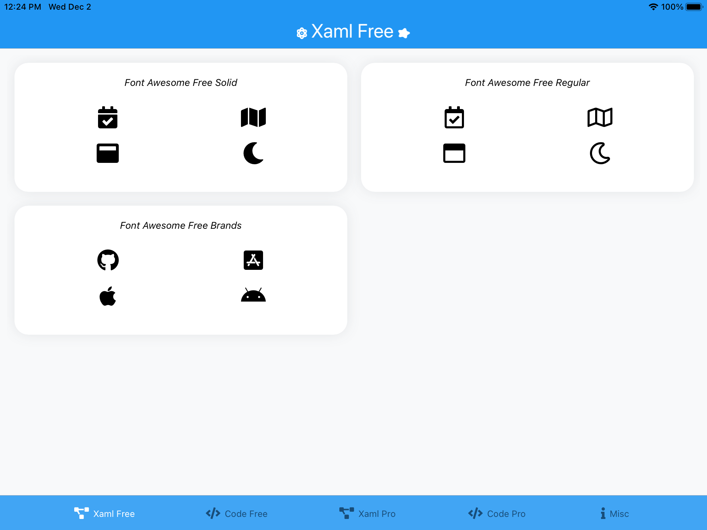
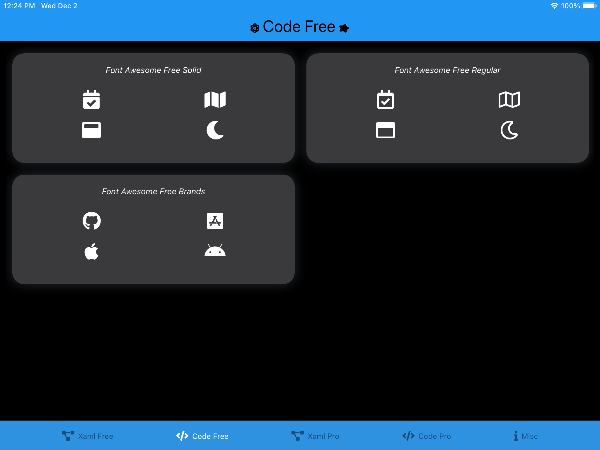
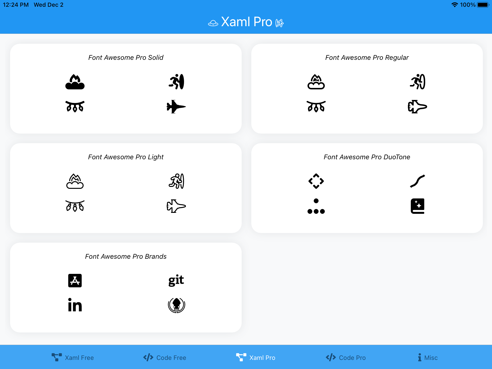
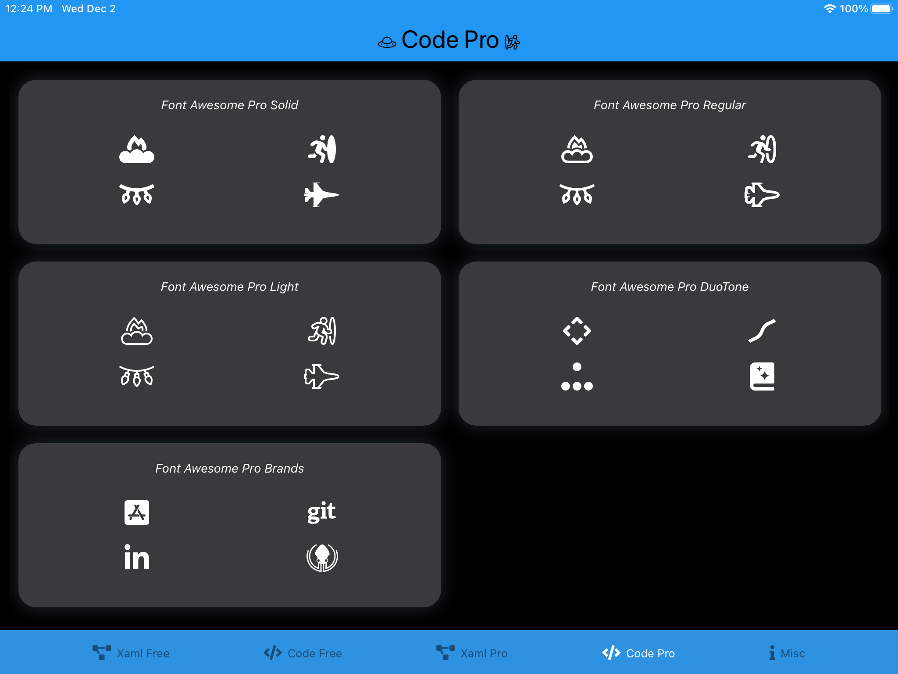
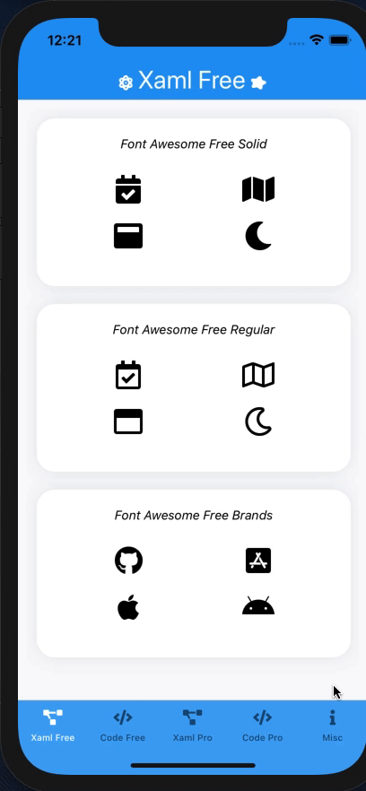
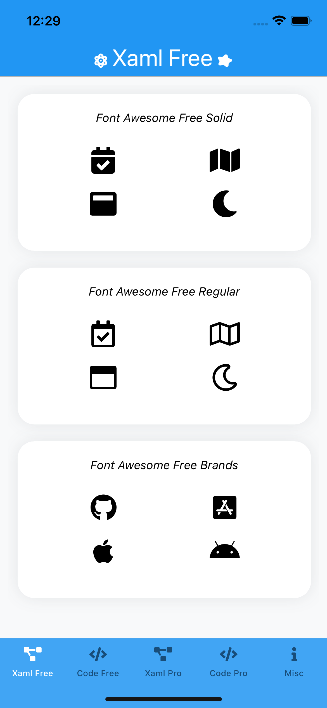
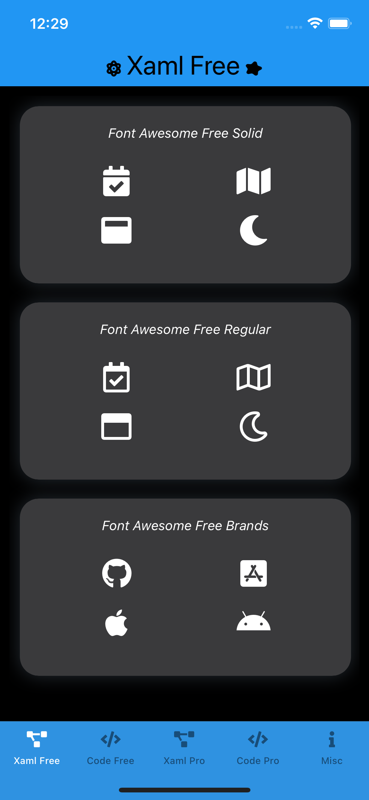
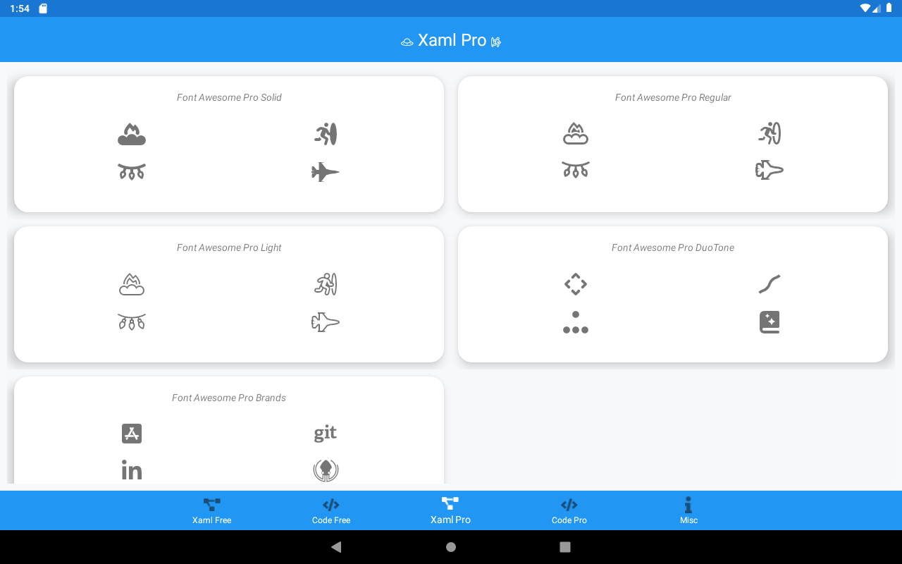

# Font Awesome Forms
A Modern Example Of Using Fonts & Font Awesome In Xamarin Forms for Pretty & Scalable UI with less bother!

- All Code Is Shared - This project demonstrates using fonts without ever touching the host platform's project 🚀
- All The Fonts - I'm using Font Awesome in this example but you can use the principals to add any font 🥳

For more screenshots of the sample app, see [here](https://github.com/Axemasta/Font-Awesome-Forms/tree/main/assets).

| Font              | Light                                                        | Dark                                                         |
| ----------------- | ------------------------------------------------------------ | ------------------------------------------------------------ |
| Font Awesome Free |  |  |
| Font Awesome Pro  |  |  |


## Installing Font Awesome (or any fonts 😉)

This repository uses Font Awesome, it includes the free fonts and references (but doesnt not include) the pro fonts. There is no extra setup in this project but you are probably here to understand how to include Font Awesome in your Xamarin Forms. app! 😁

You can download the FontAwesome fonts [here](https://fontawesome.com/download). If you don't have a Pro license select "Free for Desktop"

Once downloaded you should add the font `.otf` files to an appropriate place in your shared project. This repo utilizes the [newer method of using fonts](https://docs.microsoft.com/en-us/xamarin/xamarin-forms/user-interface/text/fonts) in Forms, which only requires them to be places in the shared project. Gone are the days of putting the fonts in the platform projects, updating `info.plist`'s and having to maintain different `FontFamily` references for each platform type. The font's build action should be set to `EmbeddedResource`.

*You may notice the Font Awesome `.otf` files are named differently in this repository, I did this simply to make their file paths look cleaner*


To make the font available in your app, go to `AssemblyInfo.cs` and add the following code:

```csharp
using Xamarin.Forms;

//Free Fonts
[assembly: ExportFont("FontAwesome5FreeBrands.otf", Alias = "FAFreeBrands")]
[assembly: ExportFont("FontAwesome5FreeRegular.otf", Alias = "FAFreeRegular")]
[assembly: ExportFont("FontAwesome5FreeSolid.otf", Alias = "FAFreeSolid")]
```

This will make each font available under the `Alias` string, so all you need to do is set `FontFamily = "FAFreeBrands"` in order to use Font Awesome! This will of course work for other fonts.


## Font Awesome Pro

I have include examples for both Font Awesome Free & Pro. For obvious reasons I have not included the Font Awesome Pro fonts in this repository, in order to get the pro samples working you will need to perform the following steps:

- Add the Font Awesome Pro `.otf` font files to `src\FontAwesomeForms\Resources\Font Awesome Pro\` (They will automatically be set to `EmbeddedResource` in this project)
- Uncomment / update the pro font export in `AssemblyInfo.cs`

The app startup searches for pro fonts in the assembly resources and will load the pro tabs if you provide fonts with the word `"pro"` in them.


## Glyphs

Here is an example of adding a glyph to a `Label`, you will need to set the `Text` to the unicode chaarcter of the glyph aswell as setting the correct `FontFamily`

Xaml

```xml
<Label Text="&#xf5d2;" FontFamily="FAFreeSolid"/>
```

Code Behind

```csharp
var label = new Label() { Text = "\uf5d2", FontFamily = "FAFreeSolid" }
```

Pay attention to the encoding of the glyph, it differs in xaml and codebehind, you must encode the glyph reference correctly, however this approach is cumbersome and easily prone to error!

I pulled in the [fa2cs](https://github.com/matthewrdev/fa2cs) library to display glyphs to make adding Font Awesome glyphs much easier. I do not believe there is a NuGet library, they recommend on this repo to simple add the `FontAwesomeIcons.cs` file to your project.

Using this file we get much stronger code readability and maintainability:

```
public string Glyph1 { get; } = "\uf5d2";
```

becomes

```
public string Glyph1 { get; } = FontAwesome.FontAwesomeIcons.Atom;
```


This is the simplest and in my opinion best way of handling Font Awesome glyphs, in other libraries they will actually bundle FontAwesome fonts in the library and provide custom objects to handle everything. This leads to an Xamarin Forms app that is heavily tied to a third party library that could be deprecated, not updated regularly and intrdouce a learning curve to your app for developers unfamiliar with the particular library. I much prefer the new approach of adding a font as an `EmbeddedResource`, using a `[ExportFont]` attribute and then referencing its name in `FontFamily`.


## App Themes

I made sure to provide Light / Dark mode theming so that you can witness the true power of having your icons as fonts! Now instead of having to maintain different icon assets for different color themes, you have granular control over the appearance of any glyph. I think this demonstrates one of the most powerful use cases of fonts for icons anywhere, this app currently supports 2 themes but the possibilites are endless. You could easily extend the app theme to provide other modes such as high contrast.



| Light                                                    | Dark                                                   |
| -------------------------------------------------------- | ------------------------------------------------------ |
|  |  |


## Who Could Forget Android

I could, and I did! i think I ran the app in Android twice during the entire development of the app. But everything worked which demonstrates the power of this way of implementing fonts 🥳 (although the shadows could do with some love!).




## Enhancements

This repository covers most of what you can do with Font Awesome fonts, there are a few more things I would like to explore:

- Animations - Anyone familiar with FA on the web will have used the `fa-spin` animations to display loading spinners, I would like to do a similar thing in Forms.
- DuoTone Fonts - I would like to figure out the best approach to using Font Awesome Pro DuoTone fonts. These are 2 seperate glyphs that when overlayed display a more complex glyph, I had a brief look at putting them together but they usually display 1 after the other and may require some bespoke code to work correctly.